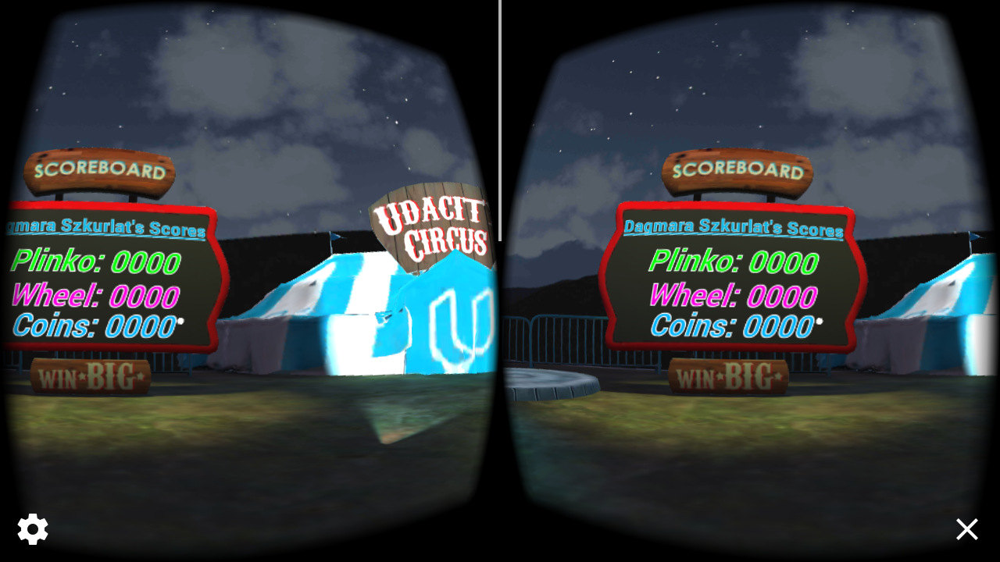

# Udacity Carnival Starter Project READ ME

This project is part of [Udacity](https://www.udacity.com "Udacity - Be in demand")'s [VR Developer Nanodegree](https://www.udacity.com/course/vr-developer-nanodegree--nd017).

An introductory project where I customized the Udacity Carnival. The Udacity Carnival consists of 3 Mini-Games: Plinko, Wheel of Fortune, and Coin Toss. With each game, you earn points. When you earn 2000 points, you will receive a virtual classic Carnival prize!

If you'd like to try it out, download the "Build.zip" folder, extract the .apk file and add it to your Android phone (if you've never installed an app from outside the app store, here's some further guidance: https://www.cnet.com/how-to/how-to-install-apps-outside-of-google-play/). Enjoy!

## Bonus things
I wanted to spice up the prize winning, so I gave the prize a location and made a sound play when it appears. I don't think it's the nicest implementation to be honest, with the update loop always checking for the state of the teddy bear, but for now I am ok with it.

## Assets used
I used the following free items from Unity's Asset Store:
- Short Music 01 (Lite) by NOMADS GAMES
- Floor Segment 2 by ZUG ZUG ART

## Versions
- Unity 2017.2.0f3
- [GVR Unity SDK v1.70.0](https://github.com/googlevr/gvr-unity-sdk/releases/tag/1.70.0)
- TextMesh Pro v1.0.55.2017.1.0b12
